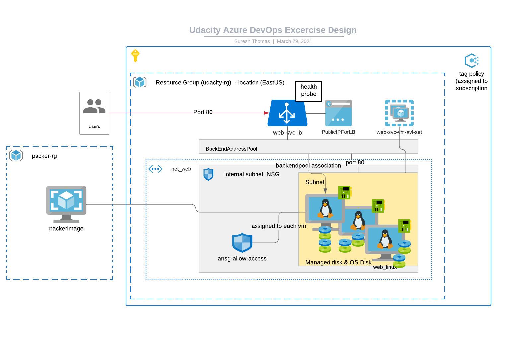

= Deploy a web service in Azure with Terraform and Packer

== How to use this project

=== Step 1 create VM image (for backend pools ) using packer

. Create a resource group for holding packager image. This can be created manually /terraform. I have created it in a resource group called packer-rg
. Udpate the server.json inside solution folder to update the resource group (line 19)

. Export the following env variables with service principle details (the same will be used for terraform as well)

[source]
----
ARM_CLIENT_ID
ARM_CLIENT_SECRET
ARM_SUBSCRIPTION_ID
----
. Buiild the packer image , assuming that packer is installed. In case you dont have env vars setup, you can also use below command

[source]
----
packer build -var 'subscription_id=xxxx' -var 'tenant_id=xxx' -var 'client_id=xxx' -var 'client_secret=xxx' server.json
----

. Make sure that you have image created in the resource group

=== Build Environment using packer
In the solution folder , go to terraform.auto.tfvars.

. Set the number of nodes in the backend pool as vm_count in linux_vms_spec
. Set the packerimage resource group in packerimage_rg =
. The rest of the infra will be created in an ${prefix}-rg. The prefix = "udacity" here
. Once you update , just run terraform plan -out solution.plan
. Make sure  that its run from solution folder
. Then you can terraform apply (optionally give solution.plan as plan name)

[source]
----

prefix         = "udacity"
location       = "EastUS"
packerimage_rg = "packer-rg" # The resource group where packer images

tagging_policy_config = {
  name         = "tagging-policy"
  policy_type  = "Custom"
  mode         = "Indexed"
  display_name = "Policy ensures all indexed resources the subscription have tags and deny deployment if they do not."
  category : "General"
}

tagging_policy_config_assn = {
  name         = "tagging-policy-assignment"
  display_name = "enforce tags"
  description  = "Assign policy ensures all indexed resources the subscription have tags and deny deployment if they do not"
  tag_name     = "tag enforcement"
}

network_address_spaces = {
  vnet_address_spaces   = ["10.0.2.0/24"]
  subnet_address_spaces = ["10.0.2.0/24"]
}

linux_vms_spec = {
  # Number of VMs in the backend pool
  vm_count       = 2
  vm_name_prefix = "udcweb"
  vm_size        = "Standard_F2"
  vm_username    = "azureuser"
  # The below will go as label
  vm_created_by = "suresh thomas"
  vm_team_name  = "udacity"
  vm_env_type   = "production"
}


----


== The overall solution - Technical details
The below gives the architecture of the application




== 1. Deploy an azure policy
The details are available in the solution folder under C1-Azure Infrastructure Operations


=== 1.1 Goal
Create a policy that ensures all indexed resources in your subscription have tags and deny deployment if they do not.

=== 1.2 Solution
This has been implemented through terraform. The tagging-policy.tf define the policy and tagging-policy-assignment.tf applies this to the subscription level

.Compliance to requirements 

* [x] Write a policy definition to deny the creation of resources that do to have tags (terraform file tagging-policy.tf)

* [x] Apply the policy definition to the subscription with same name tagging policy .  ```policy_definition_id = azurerm_policy_definition.tagging-policy.id``` relates the above policy with this.

* [x] Testing
This is  tested by executing in bash

[source]
----
# az policy assignment list
----


== 2. Packer template

=== 2.1 Goal

The first thing we're going to want to do is use Packer to create a server image, ensuring that the provided application is included in the template. 

=== 2.2 Solution

.Compliance to requirements 

Refer to the packer folder in this project to see the packer details. Note that the resource-group.tf file create a resource group

[source]
----
resource "azurerm_resource_group" "rg_web" {
  name     = "${var.prefix}-rg"
  location = var.location
}
----
The var.prefix (Refer variables.tf and terraform.auto.tfvars) has been set as 'udacity'. So the resource group name will be udacity-rg

* [x] Use Ubuntu 18.04-LTS as SKU - You can see the server.json in line 17
* [x] Ensure that busybox provisioners requirements are incorporated

[source]
----
	"provisioners": [{
		"inline": [
			"echo 'Hello, World!' > index.html",
			"nohup busybox httpd -f -p 80 &"
		],
		"inline_shebang": "/bin/sh -x",
		"type": "shell"
	}]
----
* [x] Ensure that resource group is sane as specified in terraform- The resource-group.tf can ve verified 

== 3. Terraform Template

=== 3.1 Goal

Terraform template will allow us to reliably create, update, and destroy our infrastructure. In this example, we want to use the skills we've built with variables and loops, along with our knowledge of Azure infrastructure, to deploy a web app that has been loaded into our Packer template already.

Before we get started, we'll need to verify that the policy we deployed in an earlier lesson (that one that requires tags) is still available using the Azure CLI, and include a screenshot of that policy output in our repository.

=== 3.2 Solution

.Compliance to requirements 

* [x] Create resource group.  The resource-group.tf foes this 

* [x] Create a virtual network and subnet. See the networks.tf file

The below two creates the required vnet and subnets. The CIDR ranges are configurable through the variables

[source]
----
resource "azurerm_virtual_network" "net_web"
resource "azurerm_subnet" "internal"
----

* [x] Create network security group - The nsg.tf file creates the NSG (Network Security Group)

[source]
----
# This  is the NSG
resource "azurerm_network_security_group" "allow_access"
# Rule 1 allow 80 port access
resource "azurerm_network_security_rule" "allow_access_from_intenet_80"
# Rule 2 allow all access within VNET
resource "azurerm_network_security_rule" "allow_access_from_vm_on_subnet"

----
* [x] Create a public IP - This (networks.tf). This will be assigned to a NIC (below)

[source]
----
resource "azurerm_public_ip" "web-svc-lb-ip" {
#...
#...
}

----

* [x] Create network interface and assign the IP created above 
The file networks.tf gives details , note the ip_configuration block for details on the how the IP is assigned to the NIC

[source]
----
resource "azurerm_network_interface" "main" {
 #...
 #...
 ip_configuration {
    name                          = "internal"
    subnet_id                     = azurerm_subnet.internal.id
    private_ip_address_allocation = "Dynamic"
    public_ip_address_id          = azurerm_public_ip.web-svc-lb-ip.id
  }
  #...
}web_svc_port
----
* [x] Create LB  - The implementation is available  in web-lb.tf. The frontend_ip_configuration assigns the public Ip to  LB

[source]
----
resource "azurerm_lb" "web-svc-lb" {
#...
#...
frontend_ip_configuration {
    name                 = "PublicIPAddress"
    public_ip_address_id = azurerm_public_ip.web-svc-lb-ip.id
  }
#....

}
----
* [x] Backend pool (ref web-lb.tf) assigned to the LB in the previous step

[source]
----
resource "azurerm_lb_backend_address_pool" "web-svc-lb-backend" {
  loadbalancer_id = azurerm_lb.web-svc-lb.id
  name            = "BackEndAddressPool"
}
----
* [x] A health probe is created and assigned to LB (Best practice - web-lb.tf). The port is set in the variable default 80

[source]
----
resource "azurerm_lb_probe" "web_svc_health_probe" {
  resource_group_name = azurerm_resource_group.rg_web.name
  loadbalancer_id     = azurerm_lb.web-svc-lb.id
  name                = "web-http-probe"
  port                = var.web_svc_port
}
----
 
== Terraform plan

[source]
----
An execution plan has been generated and is shown below.
Resource actions are indicated with the following symbols:
  + create

Terraform will perform the following actions:

  # azurerm_availability_set.web-svc-vm-avl-set will be created
  + resource "azurerm_availability_set" "web-svc-vm-avl-set" {
      + id                           = (known after apply)
      + location                     = "eastus"
      + managed                      = true
      + name                         = "webbackendavailabilityset"
      + platform_fault_domain_count  = 3
      + platform_update_domain_count = 5
      + resource_group_name          = "udacity-rg"
      + tags                         = {
          + "environment" = "Production"
        }
    }

  # azurerm_lb.web-svc-lb will be created
  + resource "azurerm_lb" "web-svc-lb" {
      + id                   = (known after apply)
      + location             = "eastus"
      + name                 = "WebServiceLB"
      + private_ip_address   = (known after apply)
      + private_ip_addresses = (known after apply)
      + resource_group_name  = "udacity-rg"
      + sku                  = "Basic"

      + frontend_ip_configuration {
          + id                            = (known after apply)
          + inbound_nat_rules             = (known after apply)
          + load_balancer_rules           = (known after apply)
          + name                          = "PublicIPAddress"
          + outbound_rules                = (known after apply)
          + private_ip_address            = (known after apply)
          + private_ip_address_allocation = (known after apply)
          + private_ip_address_version    = "IPv4"
          + public_ip_address_id          = (known after apply)
          + public_ip_prefix_id           = (known after apply)
          + subnet_id                     = (known after apply)
        }
    }

  # azurerm_lb_backend_address_pool.web-svc-lb-backend-pool will be created
  + resource "azurerm_lb_backend_address_pool" "web-svc-lb-backend-pool" {
      + backend_ip_configurations = (known after apply)
      + id                        = (known after apply)
      + load_balancing_rules      = (known after apply)
      + loadbalancer_id           = (known after apply)
      + name                      = "BackEndAddressPool"
      + outbound_rules            = (known after apply)
      + resource_group_name       = (known after apply)
    }

  # azurerm_lb_probe.web_svc_health_probe will be created
  + resource "azurerm_lb_probe" "web_svc_health_probe" {
      + id                  = (known after apply)
      + interval_in_seconds = 15
      + load_balancer_rules = (known after apply)
      + loadbalancer_id     = (known after apply)
      + name                = "web-http-probe"
      + number_of_probes    = 2
      + port                = 80
      + protocol            = (known after apply)
      + resource_group_name = "udacity-rg"
    }

  # azurerm_linux_virtual_machine.web_linux[0] will be created
  + resource "azurerm_linux_virtual_machine" "web_linux" {
      + admin_username                  = "azureuser"
      + allow_extension_operations      = true
      + availability_set_id             = (known after apply)
      + computer_name                   = (known after apply)
      + disable_password_authentication = true
      + extensions_time_budget          = "PT1H30M"
      + id                              = (known after apply)
      + location                        = "eastus"
      + max_bid_price                   = -1
      + name                            = "vmudcweb0"
      + network_interface_ids           = (known after apply)
      + platform_fault_domain           = -1
      + priority                        = "Regular"
      + private_ip_address              = (known after apply)
      + private_ip_addresses            = (known after apply)
      + provision_vm_agent              = true
      + public_ip_address               = (known after apply)
      + public_ip_addresses             = (known after apply)
      + resource_group_name             = "udacity-rg"
      + size                            = "Standard_F2"
      + source_image_id                 = "/subscriptions/8183c777-bc2a-4eeb-abd9-e5022e0ff6d5/resourceGroups/packer-rg/providers/Microsoft.Compute/images/ubuntuBusyBox"
      + tags                            = {
          + "created"     = "suresh thomas"
          + "environment" = "production"
          + "team"        = "udacity"
        }
      + virtual_machine_id              = (known after apply)
      + zone                            = (known after apply)

      + admin_ssh_key {
          + public_key = (known after apply)
          + username   = "azureuser"
        }

      + os_disk {
          + caching                   = "ReadWrite"
          + disk_size_gb              = (known after apply)
          + name                      = "dskudcweb0"
          + storage_account_type      = "Standard_LRS"
          + write_accelerator_enabled = false
        }
    }

  # azurerm_linux_virtual_machine.web_linux[1] will be created
  + resource "azurerm_linux_virtual_machine" "web_linux" {
      + admin_username                  = "azureuser"
      + allow_extension_operations      = true
      + availability_set_id             = (known after apply)
      + computer_name                   = (known after apply)
      + disable_password_authentication = true
      + extensions_time_budget          = "PT1H30M"
      + id                              = (known after apply)
      + location                        = "eastus"
      + max_bid_price                   = -1
      + name                            = "vmudcweb1"
      + network_interface_ids           = (known after apply)
      + platform_fault_domain           = -1
      + priority                        = "Regular"
      + private_ip_address              = (known after apply)
      + private_ip_addresses            = (known after apply)
      + provision_vm_agent              = true
      + public_ip_address               = (known after apply)
      + public_ip_addresses             = (known after apply)
      + resource_group_name             = "udacity-rg"
      + size                            = "Standard_F2"
      + source_image_id                 = "/subscriptions/8183c777-bc2a-4eeb-abd9-e5022e0ff6d5/resourceGroups/packer-rg/providers/Microsoft.Compute/images/ubuntuBusyBox"
      + tags                            = {
          + "created"     = "suresh thomas"
          + "environment" = "production"
          + "team"        = "udacity"
        }
      + virtual_machine_id              = (known after apply)
      + zone                            = (known after apply)

      + admin_ssh_key {
          + public_key = (known after apply)
          + username   = "azureuser"
        }

      + os_disk {
          + caching                   = "ReadWrite"
          + disk_size_gb              = (known after apply)
          + name                      = "dskudcweb1"
          + storage_account_type      = "Standard_LRS"
          + write_accelerator_enabled = false
        }
    }

  # azurerm_managed_disk.pool_mngd_disk[0] will be created
  + resource "azurerm_managed_disk" "pool_mngd_disk" {
      + create_option        = "Empty"
      + disk_iops_read_write = (known after apply)
      + disk_mbps_read_write = (known after apply)
      + disk_size_gb         = 1
      + id                   = (known after apply)
      + location             = "eastus"
      + name                 = "dsk_udcweb_0"
      + resource_group_name  = "udacity-rg"
      + source_uri           = (known after apply)
      + storage_account_type = "Standard_LRS"
      + tags                 = {
          + "environment" = "Production"
        }
    }

  # azurerm_managed_disk.pool_mngd_disk[1] will be created
  + resource "azurerm_managed_disk" "pool_mngd_disk" {
      + create_option        = "Empty"
      + disk_iops_read_write = (known after apply)
      + disk_mbps_read_write = (known after apply)
      + disk_size_gb         = 1
      + id                   = (known after apply)
      + location             = "eastus"
      + name                 = "dsk_udcweb_1"
      + resource_group_name  = "udacity-rg"
      + source_uri           = (known after apply)
      + storage_account_type = "Standard_LRS"
      + tags                 = {
          + "environment" = "Production"
        }
    }

  # azurerm_network_interface.linux_ni[0] will be created
  + resource "azurerm_network_interface" "linux_ni" {
      + applied_dns_servers           = (known after apply)
      + dns_servers                   = (known after apply)
      + enable_accelerated_networking = false
      + enable_ip_forwarding          = false
      + id                            = (known after apply)
      + internal_dns_name_label       = (known after apply)
      + internal_domain_name_suffix   = (known after apply)
      + location                      = "eastus"
      + mac_address                   = (known after apply)
      + name                          = "nic_udcweb_0"
      + private_ip_address            = (known after apply)
      + private_ip_addresses          = (known after apply)
      + resource_group_name           = "udacity-rg"
      + virtual_machine_id            = (known after apply)

      + ip_configuration {
          + name                          = "internal"
          + primary                       = (known after apply)
          + private_ip_address            = (known after apply)
          + private_ip_address_allocation = "dynamic"
          + private_ip_address_version    = "IPv4"
          + subnet_id                     = (known after apply)
        }
    }

  # azurerm_network_interface.linux_ni[1] will be created
  + resource "azurerm_network_interface" "linux_ni" {
      + applied_dns_servers           = (known after apply)
      + dns_servers                   = (known after apply)
      + enable_accelerated_networking = false
      + enable_ip_forwarding          = false
      + id                            = (known after apply)
      + internal_dns_name_label       = (known after apply)
      + internal_domain_name_suffix   = (known after apply)
      + location                      = "eastus"
      + mac_address                   = (known after apply)
      + name                          = "nic_udcweb_1"
      + private_ip_address            = (known after apply)
      + private_ip_addresses          = (known after apply)
      + resource_group_name           = "udacity-rg"
      + virtual_machine_id            = (known after apply)

      + ip_configuration {
          + name                          = "internal"
          + primary                       = (known after apply)
          + private_ip_address            = (known after apply)
          + private_ip_address_allocation = "dynamic"
          + private_ip_address_version    = "IPv4"
          + subnet_id                     = (known after apply)
        }
    }

  # azurerm_network_interface_backend_address_pool_association.lb_backendpool_assn[0] will be created
  + resource "azurerm_network_interface_backend_address_pool_association" "lb_backendpool_assn" {
      + backend_address_pool_id = (known after apply)
      + id                      = (known after apply)
      + ip_configuration_name   = "internal"
      + network_interface_id    = (known after apply)
    }

  # azurerm_network_interface_backend_address_pool_association.lb_backendpool_assn[1] will be created
  + resource "azurerm_network_interface_backend_address_pool_association" "lb_backendpool_assn" {
      + backend_address_pool_id = (known after apply)
      + id                      = (known after apply)
      + ip_configuration_name   = "internal"
      + network_interface_id    = (known after apply)
    }

  # azurerm_network_interface_security_group_association.web-sga[0] will be created
  + resource "azurerm_network_interface_security_group_association" "web-sga" {
      + id                        = (known after apply)
      + network_interface_id      = (known after apply)
      + network_security_group_id = (known after apply)
    }

  # azurerm_network_interface_security_group_association.web-sga[1] will be created
  + resource "azurerm_network_interface_security_group_association" "web-sga" {
      + id                        = (known after apply)
      + network_interface_id      = (known after apply)
      + network_security_group_id = (known after apply)
    }

  # azurerm_network_security_group.allow_access will be created
  + resource "azurerm_network_security_group" "allow_access" {
      + id                  = (known after apply)
      + location            = "eastus"
      + name                = "deploy-web-sg"
      + resource_group_name = "udacity-rg"
      + security_rule       = (known after apply)
      + tags                = {
          + "environment" = "azure web service"
        }
    }

  # azurerm_network_security_rule.allow_access_from_intenet_80 will be created
  + resource "azurerm_network_security_rule" "allow_access_from_intenet_80" {
      + access                      = "Allow"
      + destination_address_prefix  = "*"
      + destination_port_range      = "80"
      + direction                   = "Inbound"
      + id                          = (known after apply)
      + name                        = "HTTP_80"
      + network_security_group_name = "deploy-web-sg"
      + priority                    = 1001
      + protocol                    = "Tcp"
      + resource_group_name         = "udacity-rg"
      + source_address_prefix       = "*"
      + source_port_range           = "*"
    }

  # azurerm_network_security_rule.allow_access_from_vm_on_subnet will be created
  + resource "azurerm_network_security_rule" "allow_access_from_vm_on_subnet" {
      + access                       = "Allow"
      + destination_address_prefixes = [
          + "10.0.2.0/24",
        ]
      + destination_port_range       = "*"
      + direction                    = "Inbound"
      + id                           = (known after apply)
      + name                         = "access_from_same_subnet"
      + network_security_group_name  = "deploy-web-sg"
      + priority                     = 1002
      + protocol                     = "Tcp"
      + resource_group_name          = "udacity-rg"
      + source_address_prefixes      = [
          + "10.0.2.0/24",
        ]
      + source_port_range            = "*"
    }

  # azurerm_policy_assignment.tagging-policy-asn will be created
  + resource "azurerm_policy_assignment" "tagging-policy-asn" {
      + description          = "Assign policy ensures all indexed resources the subscription have tags and deny deployment if they do not"
      + display_name         = "enforce tags"
      + enforcement_mode     = true
      + id                   = (known after apply)
      + metadata             = jsonencode(
            {
              + category = "General"
            }
        )
      + name                 = "tagging-policy-assignment"
      + parameters           = jsonencode(
            {
              + tagName = {
                  + value = "tag enforcement"
                }
            }
        )
      + policy_definition_id = (known after apply)
      + scope                = "/subscriptions/8183c777-bc2a-4eeb-abd9-e5022e0ff6d5"

      + identity {
          + principal_id = (known after apply)
          + tenant_id    = (known after apply)
          + type         = (known after apply)
        }
    }

  # azurerm_policy_definition.tagging-policy will be created
  + resource "azurerm_policy_definition" "tagging-policy" {
      + display_name          = "Policy ensures all indexed resources the subscription have tags and deny deployment if they do not."
      + id                    = (known after apply)
      + management_group_id   = (known after apply)
      + management_group_name = (known after apply)
      + metadata              = jsonencode(
            {
              + category = "Tags"
              + version  = "1.0.1"
            }
        )
      + mode                  = "Indexed"
      + name                  = "tagging-policy"
      + parameters            = jsonencode(
            {
              + tagName = {
                  + metadata = {
                      + description = "Name of the tag, such as 'environment'"
                      + displayName = "Tag Name"
                    }
                  + type     = "String"
                }
            }
        )
      + policy_rule           = jsonencode(
            {
              + if   = {
                  + not = {
                      + exists = "false"
                      + field  = "[concat('tags[', parameters('tagName'), ']')]"
                    }
                }
              + then = {
                  + effect = "deny"
                }
            }
        )
      + policy_type           = "Custom"
    }

  # azurerm_public_ip.web-svc-lb-ip will be created
  + resource "azurerm_public_ip" "web-svc-lb-ip" {
      + allocation_method       = "Static"
      + fqdn                    = (known after apply)
      + id                      = (known after apply)
      + idle_timeout_in_minutes = 4
      + ip_address              = (known after apply)
      + ip_version              = "IPv4"
      + location                = "eastus"
      + name                    = "PublicIPForLB"
      + resource_group_name     = "udacity-rg"
      + sku                     = "Basic"
      + tags                    = {
          + "environment" = "Production"
        }
    }

  # azurerm_resource_group.rg_web will be created
  + resource "azurerm_resource_group" "rg_web" {
      + id       = (known after apply)
      + location = "eastus"
      + name     = "udacity-rg"
    }

  # azurerm_subnet.internal will be created
  + resource "azurerm_subnet" "internal" {
      + address_prefix                                 = (known after apply)
      + address_prefixes                               = [
          + "10.0.2.0/24",
        ]
      + enforce_private_link_endpoint_network_policies = false
      + enforce_private_link_service_network_policies  = false
      + id                                             = (known after apply)
      + name                                           = "internal"
      + resource_group_name                            = "udacity-rg"
      + virtual_network_name                           = "udacity-network"
    }

  # azurerm_virtual_machine_data_disk_attachment.pool_mngd_disk_attachment[0] will be created
  + resource "azurerm_virtual_machine_data_disk_attachment" "pool_mngd_disk_attachment" {
      + caching                   = "ReadWrite"
      + create_option             = "Attach"
      + id                        = (known after apply)
      + lun                       = 10
      + managed_disk_id           = (known after apply)
      + virtual_machine_id        = (known after apply)
      + write_accelerator_enabled = false
    }

  # azurerm_virtual_machine_data_disk_attachment.pool_mngd_disk_attachment[1] will be created
  + resource "azurerm_virtual_machine_data_disk_attachment" "pool_mngd_disk_attachment" {
      + caching                   = "ReadWrite"
      + create_option             = "Attach"
      + id                        = (known after apply)
      + lun                       = 10
      + managed_disk_id           = (known after apply)
      + virtual_machine_id        = (known after apply)
      + write_accelerator_enabled = false
    }

  # azurerm_virtual_network.net_web will be created
  + resource "azurerm_virtual_network" "net_web" {
      + address_space         = [
          + "10.0.2.0/24",
        ]
      + guid                  = (known after apply)
      + id                    = (known after apply)
      + name                  = "udacity-network"
      + resource_group_name   = "udacity-rg"
      + subnet                = (known after apply)
      + vm_protection_enabled = false
    }

  # tls_private_key.bastian_ssh will be created
  + resource "tls_private_key" "bastian_ssh" {
      + algorithm                  = "RSA"
      + ecdsa_curve                = "P224"
      + id                         = (known after apply)
      + private_key_pem            = (sensitive value)
      + public_key_fingerprint_md5 = (known after apply)
      + public_key_openssh         = (known after apply)
      + public_key_pem             = (known after apply)
      + rsa_bits                   = 4096
    }

Plan: 26 to add, 0 to change, 0 to destroy.

----
== Appendix

=== Packer group


=== Application group

